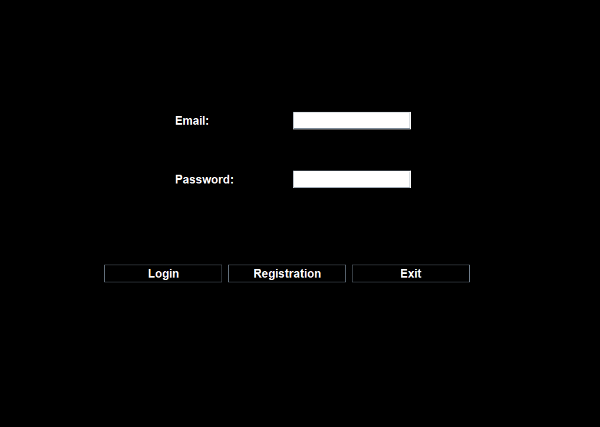
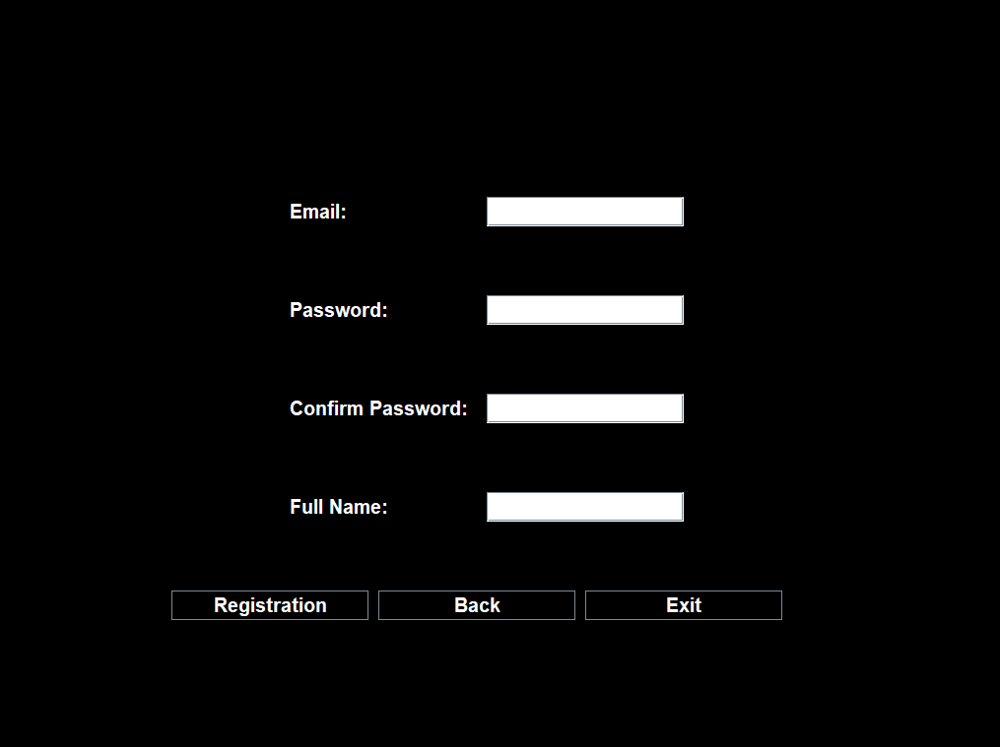
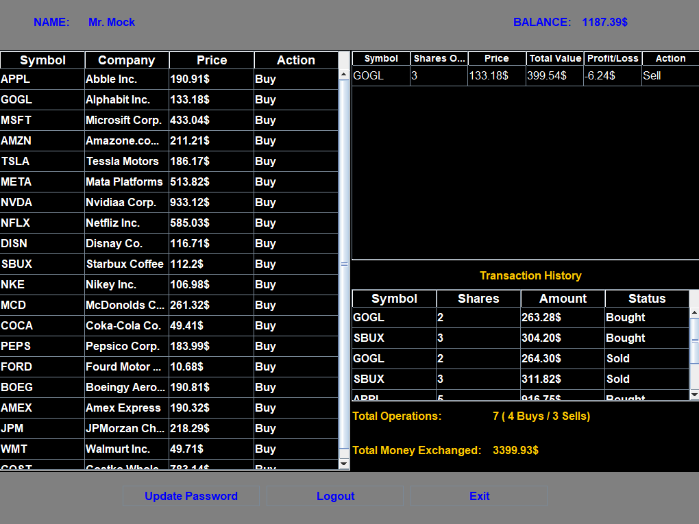
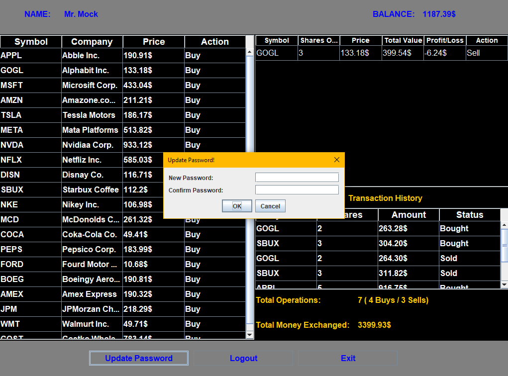

# 📈 Stock Trading Platform

A Java-based **Stock Trading Platform** developed using **Java Swing**. The application provides a simple graphical interface for users to register, log in, view stock information, and perform basic stock-trading operations.

---

## 📌 Project Overview

The **Stock Trading Platform** is a desktop application designed to simulate a stock trading environment.

The system provides users with a graphical interface where they can manage their account and interact with available stocks. The project is developed using **Java** and **Java Swing**, with the application organized into separate UI and utility components for better code management.

---

## ✨ Features

* 🔐 **User Login**

  * Secure login interface
  * Email and password authentication

* 📝 **User Registration**

  * Create a new user account
  * Store user information for future login

* 📊 **Stock Information**

  * View available stocks
  * Display stock-related information

* 💰 **Stock Trading**

  * Buy stocks
  * Sell stocks
  * Manage stock transactions

* 👤 **User Account**

  * Manage user-related information
  * Track account balance and transactions

* 🖥️ **Graphical User Interface**

  * Built using Java Swing
  * Simple and user-friendly desktop interface

---

## 🛠️ Technologies Used

| Technology                       | Purpose                                  |
| -------------------------------- | ---------------------------------------- |
| **Java**                         | Core programming language                |
| **Java Swing**                   | Graphical User Interface                 |
| **AWT**                          | GUI components and event handling        |
| **File Handling / Data Storage** | Storing application data                 |
| **Object-Oriented Programming**  | Application structure and implementation |

---

## 📂 Project Structure

```text
Stock-Trading-Platform/
│
├── src/
│   │
│   ├── ui/
│   │   ├── Login_Screen.java
│   │   ├── Registration_Screen.java
│   │   ├── Main_Screen.java
│   │   └── Splas_Screen.java
│   │
│   └── util/
│   │   ├── Global_Functions.java
│   │   └── Global_Variables.java
│   │
│   └── model/
│   │   ├── Portfolio.java
│   │   ├── Stock.java
│   │   ├── Transaction.java
│   │   └── User.java
│   │
│   └── auth/
│   │   ├── Login.java
│   │   ├── Registration.java
│   │   └── Session.java
│   │
│   └── services/
│   │   ├── Login_Service.java
│   │   ├── Registration_Service.java
│   │   ├── Market_Simulation_Service.java
│   │   ├── Portfolio_Viewer_Service.java
│   │   ├── Stock_Buy_Service.java
│   │   ├── Stock_Sell_Service.java
│   │   ├── Transaction_History_Service.java
│   │   ├── Update_Password_Service.java
│   │   ├── User_Balance_Update_Service.java
│   │   └── View_Market_Service.java
│   │
│   └── Main.java
│
├── resources/...
├── README.md
└── .gitignore
```

### `ui/`

Contains the graphical user interface of the application.

The UI package contains different screens and windows such as:

* Login Screen
* Registration Screen
* Stock-related screens
* Trading screens
* Account-related screens
* Other application windows

### `util/`

Contains reusable utility functions used throughout the application.

For example:

* Common/global functions
* Data-related helper functions
* Shared application functionality

---

## 🚀 Getting Started

### Prerequisites

Before running the project, make sure you have:

* **Java JDK 8 or later**
* A Java-compatible IDE such as:

  * IntelliJ IDEA
  * Eclipse
  * NetBeans
  * VS Code with Java extensions

---

## ▶️ How to Run

### 1. Clone the Repository

```bash
git clone https://github.com/SRSunny023/CodeAlpha_Stock-Trading-Platform.git
```

### 2. Open the Project

Open the project in your preferred Java IDE.

### 3. Configure the Project

Make sure the project is using a valid Java JDK.

### 4. Run the Application

Run the main class of the application.

---

## 🔐 Login System

The application starts with a login interface where users can provide:

* Email
* Password

Users who do not have an account can navigate to the registration interface and create an account.

---

## 📝 Registration

New users can register by providing the required information.

After successful registration, users can use their credentials to log in to the platform.

---

## 📈 Stock Trading

After logging into the platform, users can interact with the available stocks and perform trading operations.

The trading functionality allows users to:

1. View available stocks.
2. Select a stock.
3. Enter the required quantity.
4. Perform a purchase.
5. Sell owned stocks when applicable.
6. View updated account information.

---

## 🖥️ User Interface

The application is built using **Java Swing**, providing a desktop-based graphical interface.

Major UI components include:

* `JFrame`
* `JButton`
* `JLabel`
* `JTextField`
* `JPasswordField`
* `JOptionPane`

Event handling is implemented using Java's event-listener mechanism.

For example:

```java
implements ActionListener
```

is used by UI classes that need to respond to user interactions.

---

## 🧩 Object-Oriented Programming

The project follows fundamental Object-Oriented Programming concepts, including:

* **Classes and Objects**
* **Encapsulation**
* **Inheritance**
* **Abstraction**
* **Polymorphism**
* **Modular Design**

The application separates UI-related functionality from reusable utility functionality to keep the code organized.

---

## 🔄 Application Flow

```text
             ┌─────────────────┐
             │  Start Program   │
             └────────┬────────┘
                      │
                      ▼
             ┌─────────────────┐
             │   Login Screen  │
             └────────┬────────┘
                      │
              ┌───────┴────────┐
              │                │
              ▼                ▼
       ┌─────────────┐  ┌──────────────┐
       │    Login    │  │  Registration│
       └──────┬──────┘  └──────┬───────┘
              │                │
              │                ▼
              │        ┌──────────────┐
              │        │ Create User  │
              │        └──────┬───────┘
              │               │
              └───────┬───────┘
                      ▼
             ┌─────────────────┐
             │   Main Platform │
             └────────┬────────┘
                      │
          ┌───────────┼───────────┐
          │           │           │
          ▼           ▼           ▼
     ┌────────┐  ┌─────────┐  ┌─────────┐
     │ Stocks │  │  Buy    │  │  Sell   │
     └────────┘  └─────────┘  └─────────┘
                      │
                      ▼
             ┌─────────────────┐
             │ Account / Data  │
             └─────────────────┘
```

---

## 🎯 Project Objectives

The main objectives of this project are:

* To develop a functional desktop-based stock trading application.
* To implement a graphical user interface using Java Swing.
* To apply Object-Oriented Programming concepts.
* To implement user authentication.
* To simulate basic stock buying and selling operations.
* To organize a Java application into reusable and maintainable components.
* To gain practical experience in Java application development.

---

## 📚 Concepts Demonstrated

This project demonstrates practical knowledge of:

* Java Programming
* Java Swing
* GUI Design
* Event Handling
* Object-Oriented Programming
* User Authentication
* Data Management
* Exception Handling
* Modular Programming
* Desktop Application Development

---

## 📸 Screenshots

### Login Screen



### Registration Screen



### Main Screen



### Update Password Screen



---

## 🔮 Future Improvements

Possible future improvements include:

* Integration with a stock market API
* Database integration
* Advanced stock charts
* Watchlist functionality
* Improved authentication and security
* Password hashing
* Admin dashboard
* More advanced order types
* Better responsive UI design

---

## ⚠️ Disclaimer

This project is developed for **educational and demonstration purposes**.

It is a simulated stock trading platform and should not be considered a real financial trading system.

No real financial transactions are performed through this application.

---

## 📝 Author

Siamur Rahman Sunny

Daffodil International University

Bangladesh

---

## 📄 License

This project is intended for educational purposes. You may modify and use the source code for learning and development.

---

## ⭐ Acknowledgement

This project was developed to demonstrate practical implementation of **Java, Java Swing, GUI programming, and Object-Oriented Programming concepts** in a desktop application.
